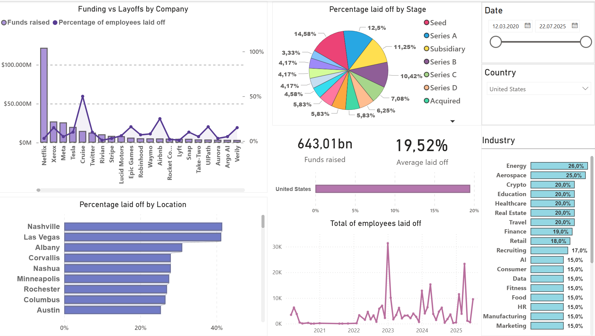

# Analysis Layoff Dynamics in Companies

## Project Overview

This project provides a visual analysis of employee layoffs using interactive Power BI dashboards. The dashboards are designed to help identify trends, patterns, and correlations between funding stages, geographical locations, industries, and layoff rates.

**Data Source**: The dataset used for this analysis was sourced from [Kaggle – Layoffs 2022 Dataset](https://www.kaggle.com/datasets/swaptr/layoffs-2022).  
**Repository**: The image above and all related project files are hosted in this GitHub repository.

---

## Dashboard Components

### 1. Funding vs Layoffs by Company
- **Type**: Combined chart (bar + line)  
- **Purpose**: Visual comparison of two key metrics—funding raised and percentage of employees laid off—for each company.  
- **Insight**: Highlights how different companies balance funding with workforce management decisions.

### 2. Percentage Laid Off by Stage
- **Type**: Pie chart  
- **Purpose**: Shows how layoffs are distributed across different funding stages (e.g., Seed, Series A, B).  
- **Insight**: Identifies the stages in a startup's lifecycle where layoffs occur most frequently.

### 3. Percentage Laid Off by Location
- **Type**: Horizontal bar chart  
- **Purpose**: Compares layoff percentages across different geographical locations.  
- **Insight**: Highlights regions with the highest workforce reductions.

### 4. Total Employees Laid Off Over Time
- **Type**: Line chart  
- **Purpose**: Displays the trend of layoffs over time (by year and month).  
- **Insight**: Allows observation of peaks and dips in overall staff reductions.

### 5. Layoffs by Industry
- **Type**: Horizontal bar chart  
- **Purpose**: Compares the percentage of layoffs across different industries.  
- **Insight**: Pinpoints sectors most vulnerable to workforce downsizing.

---

## Key Performance Indicators (KPIs)

- **Funding Raised**: Total amount of funding aggregated across all filtered companies.  
- **Average Laid Off**: Average percentage of laid-off employees in the current dataset.

---

## Purpose

Each visualization provides insights into workforce dynamics through the lens of layoffs. Filters and interactive features allow for dynamic analysis by:

- Company  
- Location  
- Industry  
- Funding stage  
- Time period  

---

## Technologies Used

- **Power BI** – Data modeling, DAX, and report creation  
- **GitHub** – Version control, documentation, and image hosting  
- **Kaggle** – Dataset for layoff analysis  
